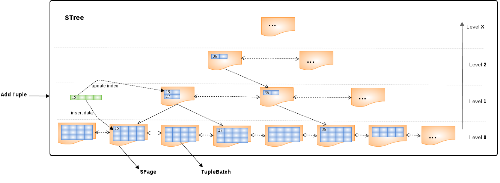

= STree

* A `STree` is a https://en.wikipedia.org/wiki/Skip_list[Skip List] based self balancing search tree, has similar performance to a B+ Tree, but with fewer updates. 
* All tuples be kept in Level 0 per page with a ascending order, the level ahead of Level 0 use to keep all indexs(subelements of a tuple).
* Each pages in a `STree` always linked with prev page and next page dually.
* The Page kept the index also has a children list point to pages in its ancestor list.
* A `STree` has a keyManager, a leafManager and a lobManager, keyManager used to form indexs and add it to Buffer, the leafManager used to form tuples in Level 0 to TupleBatch and add it to Buffer, the LobManager used to pruge the Blob/Clob/Object column to FileStore directly.
* A `STree` support Insert/Update/Select/Delete against tuple.
* A `STree` can create a TupleSource, which the tuples can be get iteratively.

.*Key flags of STree*
|===
|Name |Discription

|rowCount
|How many rows existed in a `STree`

|pageSize
|How many pages existed in a `STree`

|leafSize
|How many leafs be allowed in a tree node

|keyLength
|
|===

== Example

[source,java]
----
ElementSymbol id = new ElementSymbol("id", new GroupSymbol("Users"), String.class);
ElementSymbol name = new ElementSymbol("name", new GroupSymbol("Users"), String.class);  
ElementSymbol phone = new ElementSymbol("phone", new GroupSymbol("Users"), String.class);
ElementSymbol address = new ElementSymbol("address", new GroupSymbol("Users"), String.class);
ElementSymbol country = new ElementSymbol("country", new GroupSymbol("Users"), String.class);
        
List<ElementSymbol> elements = Arrays.asList(id, name, phone, address, country);
BufferManager bm = BBuffer.Factory.builder().bufferDir("target/buffer").build();

STree tree = bm.createSTree(elements, "Users", 2);
int size = 1 << 7;
int logSize = tree.getExpectedHeight(size);
for(int i = 1 ; i <= size ; i ++) {
    tree.insert(Arrays.asList("" + i, "name-" + i, "123456789", "Beijing", "CN"), InsertMode.NEW, logSize);
}

TupleSource source = tree.getTupleSource(false);
List<?> tuple = null;
while((tuple = source.nextTuple()) != null) {
    ...
}
----
