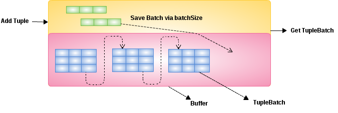

= TupleBuffer

* A `TupleBuffer` is bind with a TupleSource, is a bridge between TupleSource and Buffer, it used to keep all tuples from a TupleSource. At a specific processing time, the `TupleBuffer` only keep a less than batchSize number of Tuples, the others be kept in Buffer per Batch.
* A `TupleBuffer` can get the batch containing the given row, the returned batch may be empty or may begin with a row other than the one specified.
* A `TupleBuffer` can create a TupleSource, which the tuples can be get iteratively.
* A `TupleBuffer` has a BatchManager and a LobManager, the BatchManager used to form tuples to a TupleBatch and add it to Buffer, the LobManager used to pruge the Blob/Clob/Object column to FileStore directly.

.*Key flags of TupleBuffer*
|===
|Name| Discription

|tupleSourceID
|the id of TupleSource

|rowCount
|hints how many tuples in `TupleBuffer`, or how many tuples in a TupleSource.

|batchSize
|the size of a TupleBatch, while the tuple be add to `TupleBuffer`, once the batchSize of tuples be added, a TupleBatch will be created and added to Buffer.

|isFinal
|if set to true hints all tuples from TupleSource be add to `TupleBuffer`.

|forwardOnly
|hints the TupleBatch will be removed from `TupleBuffer` once be get.

|removed
|default is false, only be set to true once all TupleBatch be removed.
|===

== Example

Below is a exmaple of add tuple to `TupleBuffer`, get TupleBatch from `TupleBuffer` and create TupleSource via `TupleBuffer`:

[source,java]
----
ElementSymbol id = new ElementSymbol("id", new GroupSymbol("Users"), Integer.class);
ElementSymbol name = new ElementSymbol("name", new GroupSymbol("Users"), String.class);
List<ElementSymbol> elements = Arrays.asList(id, name);
        
BufferManager bm = BBuffer.Factory.builder().bufferDir("target/buffer").build();
TupleBuffer tb = bm.createTupleBuffer(elements, "Users", TupleSourceType.PROCESSOR);
tb.setBatchSize(4);
        
for(int i = 0 ; i < 10 ; i ++) {
    tb.addTuple(Arrays.asList(i, "name-" + i));
}
tb.setFinal(true);
        
TupleBatch batch = tb.getBatch(6);     
System.out.println(batch);

TupleBufferTupleSource tupleSource = tb.createIndexedTupleSource();
while(tupleSource.hasNext()) {
    System.out.println(tupleSource.nextTuple());
}
tupleSource.closeSource();
----
