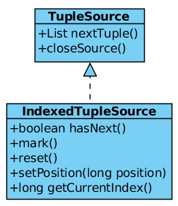

= TupleSource

image:img/tuplesource.png[ADT - TupleSource]

* A `TupleSource` is a matrix data set, it equivalent to a set of rows in RDBMS Table, it also have a header row which contain the name of column, and the data rows contain datas.
* A `TupleSource` is a cursored source of tuples which splited into several link:tuplebatch.adoc[tuple batch] 
* A `TupleSource` like JDBC ResultSet, which has ability to hasNext, get next, etc.

== Implements

== Examples

[source,java]
.*A simple CollectionTupleSource*
----
List<List<?>> tuples = new ArrayList<>();
for(int i = 0 ; i < 10 ; i ++) {
    tuples.add(Arrays.asList(i, "name-" + i));
}
CollectionTupleSource tupleSource = new CollectionTupleSource(tuples.iterator());
List<?> tuple = null;
while((tuple = tupleSource.nextTuple()) != null) {
    System.out.println(tuple);
}
----
