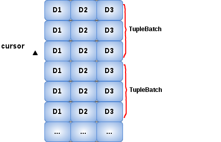

= TupleSource

* A `TupleSource` is a matrix data set, it equivalent to a set of rows in RDBMS Table, it also have a header row which contain the name of column, and the data rows contain datas.
* A `TupleSource` ia a cursored source of tuples which splited into several link:tuplebatch.adoc[tuple batch] 
* A `TupleSource` like JDBC ResultSet, which has ability to hasNext, get next, etc.

== Implements

== Examples
