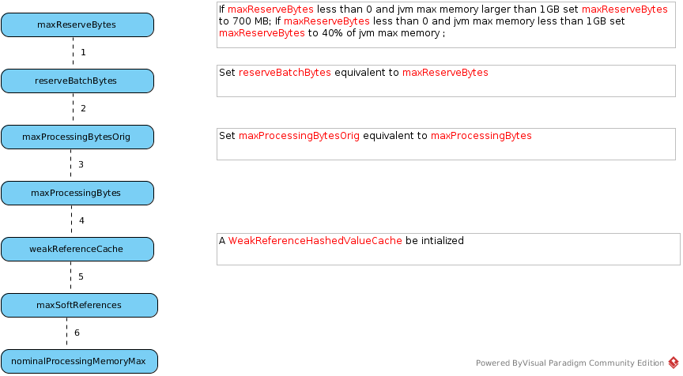

= BufferManager

== BufferManager Starting

There are 4 steps in BufferManager Starting:

1. Initialize buffer properties
2. Start buffer cleaner
3. Further initializing
4. Initialize buffer cache and storage manager

=== BufferManager Properties

[cols="2,2,5a"]
|===
|Name |Default |Description

|processorBatchSize
|256
|Specifies the target row count of a link:../adt/tuplebatch.adoc[TupleBatch]

|maxProcessingBytes
|1 << 21
|

|maxReserveBytes
|1 << 28
|

|reserveBatchBytes
|0
|* Set equivalent to `maxReserveBytes` in  BufferManager initializing

|maxProcessingBytesOrig
|null
|* Set equivalent to `maxProcessingBytes` in  BufferManager initializing

|overheadBytes
|0
|

|maxActivePlans
|20
|

|useWeakReferences
|true
|

|inlineLobs
|true
|

|targetBytesPerRow
|2018
|

|maxSoftReferences
|0
|

|nominalProcessingMemoryMax
|1 << 21
|

|activeBatchBytes
|0
|

|readAttempts
|0
|

|tsId
|0
|

|batchAdded
|0
|

|readCount
|0
|

|writeCount
|0
|

|referenceHit
|0
|

|cleaning
|false
|

|removed
|0
|

|===

=== Start buffer cleaner

//TODO

=== Further initializing

The further initializing implemented by BufferManagerImpl's initialize() method be invoked, the following properties or attributes be initializd as a order:

